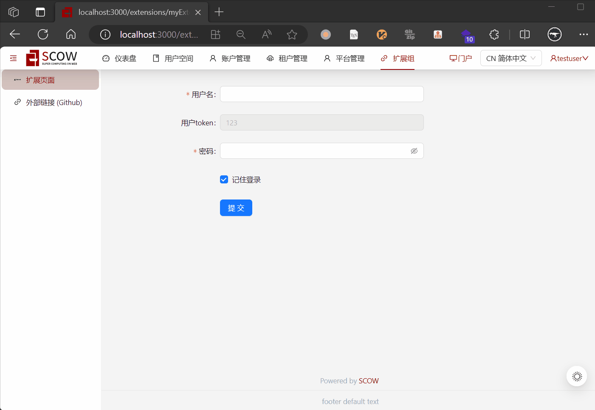

# SCOW UI扩展示例

此项目开发了一个简单的SCOW UI扩展站，可用于测试SCOW UI扩展功能。



## 测试

```sh
# 在16566端口启动此扩展
pnpm dev

# 在SCOW的配置文件中增加此配置
# 参考https://pkuhpc.github.io/SCOW/docs/integration/ui-extension#%E9%85%8D%E7%BD%AEscow%E4%BD%BF%E7%94%A8ui%E6%89%A9%E5%B1%95
```